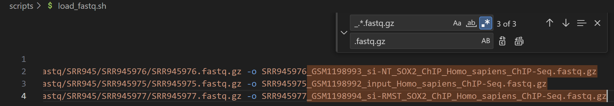

# CHIP-Seq

# Введение

В данном практическом задании вы научитесь определять сайт связывания транскрипционного фактора на основании ChIP-Seq данных.
Для этого мы будем реконструировать результаты, полученные в следующей статье:

[NCBI - WWW Error Blocked Diagnostic](http://www.ncbi.nlm.nih.gov/pubmed/23932716)

Известно, что многие длинные некодирующие РНК (lncRNAs) специфически экспрессируются в головном мозге. В рассматриваемом исследовании идентифицировали группу lncRNAs, которые необходимы для нейрогенеза. В том числе транскрипт, ассоциированный с рабдомиосаркомой (RMST). RMST участвует в модулировании нейрогенеза, – экспрессия RMST специфична для головного мозга, регулируется репрессором транскрипции REST и увеличивается во время дифференцировки нейронов, что указывает на роль в нейрогенезе.
RMST взаимодействует с транскрипционным фактором SOX2, и они совместно регулируют группу нижестоящих генов, участвующих в нейрогенезе. Было обнаружено, что RMST необходим для связывания SOX2 с промоторными областями нейрогенных факторов транскрипции. Это указывает на участие RMST в качестве ко-регулятора транскрипции SOX2 и  на его ключевую роль в регуляции дифференцировки нейральных стволовых клеток.

Каждому из вас нужно будет анализировать сайты связывания транскрипционного фактора SOX2 в пределах одной определенной хромосомы. Ниже приведен пример запуска программ для X-хромосомы – не забывайте во всех командах поменять chrX на номер вашей хромосомы.

# Подготовим рабочее пространство

Я работаю на компухтере с операционной системой Windows. Поэтому перед началом работы были установлены `WSL` и `Ubuntu 22.04.3`. Так же дополнительно была установлена `Miniforge3-Linux-x86_64`.

Переда началом подготовим рабочее пространство, а именно создадим рабочую директорию и все необходимые вложенные файлы.

```bash
# Создадим рабочую дирректорию и переместимся в неё
$ mkdir -p omics_hw/chipseq
$ cd omics_hw/chipseq

# Cоздадим необходимые дирректории
$ mkdir fastq_files # дирректория с чистыми .fastq файлы
$ mkdir scripts # дирректория со скриптами с помощью которых мы будем обрабатывать данные
$ mkdir references # дирректория c геномным референсом, аннотацией и индексами для генома
$ mkdir qc # дирректория с отчётами о качестве наших данных
```

# Скачивание файлов

Скачаем данные **GSE49405** **при помощи [SRA Explorer](https://sra-explorer.info/#). Для этого создадим скрипт `load_fastq.sh` в дирректории `scripts`. Добавим `$1` перед названием файла чтобы указать необходимую нам директорию.

```bash
#!/usr/bin/env bash
curl -L ftp://ftp.sra.ebi.ac.uk/vol1/fastq/SRR945/SRR945976/SRR945976.fastq.gz -o $1/SRR945976.fastq.gz
curl -L ftp://ftp.sra.ebi.ac.uk/vol1/fastq/SRR945/SRR945975/SRR945975.fastq.gz -o $1/SRR945975.fastq.gz
curl -L ftp://ftp.sra.ebi.ac.uk/vol1/fastq/SRR945/SRR945977/SRR945977.fastq.gz -o $1/SRR945977.fastq.gz
```

- *P.S. про переименовывание файлов*
    
    Изначально `bash` скрипт в SRA Explorer выглядел следующим образом
    
    ```bash
    #!/usr/bin/env bash
    curl -L ftp://ftp.sra.ebi.ac.uk/vol1/fastq/SRR945/SRR945976/SRR945976.fastq.gz -o SRR945976_GSM1198993_si-NT_SOX2_ChIP_Homo_sapiens_ChIP-Seq.fastq.gz
    curl -L ftp://ftp.sra.ebi.ac.uk/vol1/fastq/SRR945/SRR945975/SRR945975.fastq.gz -o SRR945975_GSM1198992_input_Homo_sapiens_ChIP-Seq.fastq.gz
    curl -L ftp://ftp.sra.ebi.ac.uk/vol1/fastq/SRR945/SRR945977/SRR945977.fastq.gz -o SRR945977_GSM1198994_si-RMST_SOX2_ChIP_Homo_sapiens_ChIP-Seq.fastq.gz
    ```
    
    Я переименовал файлы при помощи `regex` в VS Code следующим образом:
    
    
    

# QC для сырых образцов

Создадим мамбавское (анакондавское) окружение и установим  `fastqc`, `multiqc`

```bash
$ mamba create -y -n preprocess -c conda-forge -c bioconda fastqc multiqc
$ mamba activate preprocess
```

Теперь сделаем файл с запуском анализа качества прочтений

```bash
#!/bin/bash
### Run QC
fastqc -o qc -t 8 fastq_files/*.fastq.gz

### Run MultiQC
multiqc qc --outdir qc --filename multiqc.html --title "Read quality" --force --no-data-dir
```

Запустим скрипт

```bash
$ bash scripts/qs_script.sh
```

- *Результаты*
    
    [multiqc.html](figures/multiqc.html)
    

Качестве чтений получилось достаточно хорошим, поэтому не будем ничего триммить.

# Картирование

## Скачаем файлы с референсом

Составим скрипт для скачивания

```bash
#!/bin/bash
# скачаем референс с ENSEMBL
wget https://ftp.ensembl.org/pub/release-111/fasta/homo_sapiens/dna/Homo_sapiens.GRCh38.dna.primary_assembly.fa.gz
gzip -d Homo_sapiens.GRCh38.dna.primary_assembly.fa.gz
mv Homo_sapiens.GRCh38.dna.primary_assembly.fa references/genome.fa

# скачаем аннотацию
wget https://ftp.ensembl.org/pub/release-111/gtf/homo_sapiens/Homo_sapiens.GRCh38.110.gtf.gz
gzip -d Homo_sapiens.GRCh38.110.gtf.gz
mv Homo_sapiens.GRCh38.110.gtf references/genome.gtf
```

## Bowtie2

- Полезные материалы
    
    [Bowtie2](https://rnnh.github.io/bioinfo-notebook/docs/bowtie2.html)
    
    [Bowtie 2: Manual](https://bowtie-bio.sourceforge.net/bowtie2/manual.shtml)
    

Создадим отдельное окружение с `bowtie2`

```bash
$ mamba create -n bowtienv -c bioconda bowtie2
```

Проиндексируем геном

```bash
$ mkdir -p references/bowtieIndex # создадим папку для индексов
$ bowtie2-build --threads 8 references/genome.fa references/bowtieIndex/humanIndex# запустим индексирование
```

Теперь запустим картирование образцов

```bash
#!/usr/bin/env bash
# make directories for quantified samples
mkdir -p bowtieOutput

# bowtie alignment
for infile in fastq_files/*.fastq.gz
do
  base=$(basename -a -s .fastq.gz ${infile})
  mkdir -p bowtieOutput/${base}
  bowtie2 --no-unal --threads 16 -x references/bowtieIndex/humanIndex -U $infile -S bowtieOutput/${base}/${base}.sam
done
```

Запустим скрипт

```bash
$ bash scripts/bowtie_align.sh
```

Для дальнейшего анализа нам нужно конвертировать `.sam` файлы в `.bed` . Для этого воспользуемся `sam2bed` из пакета `bedops`

```bash
$ mamba install bedops -c bioconda
```

Напишем скрипт

```bash
#!/usr/bin/env bash

for infile in bowtieOutput/*/*.sam
do
  base=$(basename -a -s .sam ${infile})
  sam2bed --max-mem 4G < $infile > bowtieOutput/${base}/${base}.bed
done
```

Так же для экономии времени возьмём только одну хромосому

```bash
#!/usr/bin/env bash

for infile in bowtieOutput/*/*.bed
do
  base=$(basename -a -s .bed ${infile})
  grep $1 $infile > bowtieOutput/${base}/${base}.chr${1}.bed
done
```

```bash
$ bash scripts/subset_chr.sh "18"
```

# Macs2

- Полезные материалы
    
    [Peak calling with MACS2](https://hbctraining.github.io/Intro-to-ChIPseq/lessons/05_peak_calling_macs.html)
    

Создадим окружение для `macs2`

```bash
$ mamba create --name macsenv -c bioconda macs2
```

Скрипт для запуска

```bash
#!/usr/bin/env bash

mkdir -p macs2Output
ctrl="SRR945975"

for sample in "SRR945976" "SRR945977"
do
  echo $sample
  mkdir -p macs2Output/${sample}
  macs2 callpeak -t bowtieOutput/${ctrl}/${ctrl}.chr18.bed -c bowtieOutput/${sample}/${sample}.chr18.bed -g hs -n SOX2.${sample}.chr18 --outdir macs2Output/${sample} 2> macs2Output/${sample}/${sample}.log
done
```

Запустим скрипт

```bash
$ bash scripts/callpeaks.sh
```

# Homer

- Полезные материалы
    
    [Getting started with Homer](https://www.fieldtriptoolbox.org/getting_started/homer/)
    
    [Homer ChIP-seq analysis — HemTools latest documentation](https://hemtools.readthedocs.io/en/latest/content/Bioinformatics_tools/homer.html)
    

Создадим окружение для `homer`

```bash
$ mamba create --name homenv -c bioconda homer
```

Скрипт для поиска мотивов

```bash
#!/usr/bin/env bash

mkdir -p homerOutput

for file in macs2Output/*/*.narrowPeak
do
  base=$(basename -a -s .chr18_peaks.narrowPeak ${file})
  echo $base
  mkdir -p homerOutput/${base}
  findMotifsGenome.pl $file references/genome.fa homerOutput/${base} 2> homerOutput/${base}/homer.log
done
```

Запустим скрипт

```bash
$ bash scripts/motiFinder.sh
```

- Результаты
    
    [SRR945976.html](figures/SRR945976.html)
    
    [SRR945977.html](figures/SRR945977.html)
    

К сожалению интересующий мотив не был найден в обоих образцах


